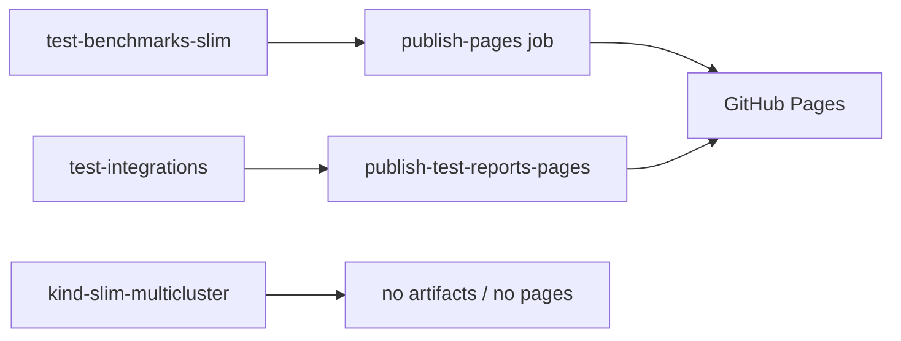
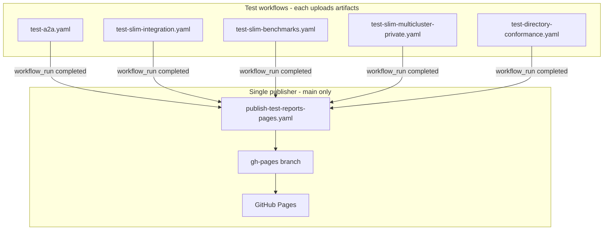

# GitHub Workflows Refactor for Test Reports

## Current state

Today, most integration tests live in one workflow (`[.github/workflows/test-integrations.yaml](.github/workflows/test-integrations.yaml)`) and Pages publishing is split across two paths:




Gaps relative to your goals:

- Five test areas are coupled in one workflow (or missing from Pages entirely).
- `[test-benchmarks-slim.yaml](.github/workflows/test-benchmarks-slim.yaml)` duplicates publish logic in its `publish-pages` job (lines 449–589).
- `[publish-test-reports-pages.yaml](.github/workflows/publish-test-reports-pages.yaml)` only listens to `test-integrations` and rebuilds the site from ephemeral runner state (no persistent branch).
- Slim integration artifacts exist (`slim-test-result`) but are not rendered on Pages. Directory integration tests are being dropped from CI.
- The landing page only conditionally shows report cards; it does not summarize all workflows.

## Target architecture




**Publishing rule:** test workflows run on PRs and `main`; only completed runs whose `head_branch` is `main` trigger the publisher (same guard as today in `[publish-test-reports-pages.yaml` line 39](.github/workflows/publish-test-reports-pages.yaml)).

---

## 1. Split `test-integrations.yaml` into five workflows

Delete (or retire after migration) `[test-integrations.yaml](.github/workflows/test-integrations.yaml)` and extract jobs into dedicated files under `[.github/workflows/](.github/workflows/)`.


| New workflow file                     | Source / rename                          | Key behavior                                                                           |
| ------------------------------------- | ---------------------------------------- | -------------------------------------------------------------------------------------- |
| `test-a2a.yaml`                       | `run-tests-a2a`                          | 10-matrix SDK pairs, path filter on `integrations/agntcy-a2a/`**                       |
| `test-slim-integration.yaml`          | `run-tests-slim-topology` (expanded)     | See section 1a below                                                                   |
| `test-directory-conformance.yaml`     | `run-tests-directory-conformance`        | `task integrations:directory:tests:client-server:test:all` (`continue-on-error: true`) |
| `test-slim-benchmarks.yaml`           | rename from `test-benchmarks-slim.yaml`  | **Remove `publish-pages` job** (lines 449–589); keep smoke/capacity/basic jobs         |
| `test-slim-multicluster-private.yaml` | rename from `kind-slim-multicluster.yml` | See section 1b below                                                                   |


### 1a. `test-slim-integration` scope

Replaces the old `test-slim-topology` / `run-tests-slim-topology` job. Validates that Slim data-plane, control-plane built from a given tag works with Python examples based on the same bindings tag deployed on a **KinD multicluster topology** (controller + peer clusters via `[deploy-components](.github/actions/deploy-components/action.yaml)` with `deploy-spire: true`, `deploy-slim-topology: true`).

**Components under test:**

- Slim **data-plane** (node images built from a given tag)
- Slim **control-plane** (controller image built from a given tag)
- **Python bindings examples** (`ghcr.io/agntcy/slim/bindings-examples`, loaded into KinD as today)

**Test task:** `task integrations:slim:test:topology` — multicluster topology connectivity.

**Artifact:** `slim-integration-test-result` (replaces `slim-test-result` / `slim-topology-test-result`)

### 1b. `test-slim-multicluster-private` scope

Replaces `[kind-slim-multicluster.yml](.github/workflows/kind-slim-multicluster.yml)`. Validates **two Slim KinD clusters connected via SPIRE federation**, where **cluster B is private** — no inbound network connections from outside; cross-cluster communication is outbound-only from the private side through SPIRE-trusted channels.

**Directory move:** relocate `[kind-slim-multi-host/](kind-slim-multi-host/)` → `[integrations/agntcy-slim/multicluster-private/](integrations/agntcy-slim/multicluster-private/)` (Taskfiles, helm values, scripts, agents, compose, coredns, README). Update all references (workflow `working-directory`, path filters, docs under `docs/plans/`, sibling-path defaults in Taskfile).

**Implementation notes:**

- Workflow `working-directory`: `integrations/agntcy-slim/multicluster-private`
- Existing `task cluster:up` → `task stack:install` flow unchanged after move
- Checkout `agntcy/slim@main`, build and load images into both clusters (unchanged)
- SPIRE root on cluster A, downstream SPIRE on cluster B (see `helm/values/spire-cluster-a-values.yaml` under new path)
- Verification steps should explicitly assert private-cluster constraints (no ingress LB on cluster B, outbound-only dataplane reachability)
- Add report artifact generation (section 4)

**Artifact:** `slim-multicluster-private-test-result` (reports under `integrations/agntcy-slim/multicluster-private/reports/`)

### 1c. Trigger policy (on demand only)

All five test workflows use the same trigger model — **no `schedule`**. Remove the daily cron from `[test-integrations.yaml](.github/workflows/test-integrations.yaml)` when retired; do not add `schedule` to any new workflow. The `run-tests-directory` job is **not** extracted — directory integration tests are retired with `test-integrations.yaml`.

| Workflow                         | `push` / `pull_request` | `workflow_dispatch` |
| -------------------------------- | ----------------------- | ------------------- |
| `test-a2a`                       | yes (path-filtered)     | yes                 |
| `test-slim-integration`          | yes (path-filtered)     | yes                 |
| `test-slim-benchmarks`           | yes (path-filtered)     | yes                 |
| `test-slim-multicluster-private` | yes (path-filtered)     | yes                 |
| `test-directory-conformance`     | yes (path-filtered)     | yes                 |

### Shared conventions (all test workflows)

- Reuse existing composite actions: `[setup-env](.github/actions/setup-env/action.yaml)`, `[setup-k8s](.github/actions/setup-k8s/action.yaml)`, `[deploy-components](.github/actions/deploy-components/action.yaml)`, `[create-artifact](.github/actions/create-artifact/action.yaml)`.
- Copy path-filter logic from `detect-changes` into each workflow (scoped to its integration path + shared CI paths list from lines 87–97 of `test-integrations.yaml`).
- Keep `workflow_dispatch` inputs where they matter (image/chart overrides, kind version).
- **On demand only:** path-filtered `push`/`pull_request` + `workflow_dispatch`; no `schedule` on any workflow.
- Drop `combine-all-artifacts` cross-workflow zip; each workflow keeps its own step summary (pattern already in A2A/benchmark jobs).
- **Agentic apps** (`run-agentic-apps`) is not in your list — move to optional `test-agentic-apps.yaml` or leave as manual-only follow-up.

### Standard artifact contract

Define stable artifact names (publisher depends on these):


| Workflow                         | Workflow file                         | Artifact name(s)                               | Raw report paths                                                     |
| -------------------------------- | ------------------------------------- | ---------------------------------------------- | -------------------------------------------------------------------- |
| `test-a2a`                       | `test-a2a.yaml`                       | `a2a-interop-test-result-{pair}` (10)          | `integrations/agntcy-a2a/reports/`*                                  |
| `test-slim-integration`          | `test-slim-integration.yaml`          | `slim-integration-test-result`                 | `integrations/agntcy-slim/reports/report-slim-*.json` (+ xml)        |
| `test-slim-benchmarks`           | `test-slim-benchmarks.yaml`           | `slim-benchmark-{smoke,capacity,basic}-report` | `benchmarks/agntcy-slim/published/{smoke,capacity,basic}/`             |
| `test-slim-multicluster-private` | `test-slim-multicluster-private.yaml` | `slim-multicluster-private-test-result`        | `integrations/agntcy-slim/multicluster-private/reports/summary.html` |
| `test-directory`                 | `test-directory.yaml`                 | `directory-test-result`                        | `integrations/agntcy-dir/reports/report-agntcy-dir.json` (+ xml)    |
| `test-directory-conformance`     | `test-directory-conformance.yaml`     | `directory-conformance-test-result`            | `./summary.html`                                                     |


---

## 2. GitHub Pages folder layout (one folder per workflow)

Publisher writes to these paths on the `gh-pages` branch (site root = branch root):


| Site path                    | Workflow                         | Source                                                            |
| ---------------------------- | -------------------------------- | ----------------------------------------------------------------- |
| `a2a/`                       | `test-a2a`                       | merged A2A dashboard (`report_dashboard.go`)                      |
| `slim-integration/`          | `test-slim-integration`          | slim JSON/XML → HTML via existing A2A dashboard tool              |
| `benchmarks/slim/`           | `test-slim-benchmarks`           | smoke/capacity/basic bundles + merged benchmark dashboard         |
| `slim-multicluster-private/` | `test-slim-multicluster-private` | verification summary HTML                                         |
| `directory-conformance/`     | `test-directory-conformance`     | `summary.html` from conformance run                               |
| `index.html`                 | —                                | landing page + **dashboard summary of all workflows**             |
| `sources.json`               | —                                | metadata for all five workflows (run IDs, conclusions, timestamps) |


---

## 3. Dashboard summary — all workflows

The landing page must **always list all five test workflows**, not only those with a current artifact.

### `sources.json` (committed on `gh-pages`)

Publisher writes/updates a JSON file alongside the site:

```json
{
  "workflows": [
    { "id": "test-a2a", "name": "A2A interoperability", "run_id": "123", "conclusion": "success", "updated_at": "...", "report_path": "a2a/" },
    { "id": "test-slim-integration", "name": "Slim integration", ... },
    { "id": "test-slim-benchmarks", "name": "Slim benchmarks", ... },
    { "id": "test-slim-multicluster-private", "name": "Slim multicluster private", ... },
    { "id": "test-directory-conformance", "name": "Directory conformance", ... }
  ]
}
```

For each workflow the publisher:

1. Resolves the latest completed run on `main` (whether or not it produced an artifact).
2. Records run ID, conclusion, and timestamp in `sources.json`.
3. If an artifact exists, refreshes the report folder; if not, keeps the previous report folder (if any) and marks status accordingly.

### Update `[build-site-landing-page.sh](.github/scripts/build-site-landing-page.sh)`

- Read `sources.json` (or equivalent env vars passed by publisher) to render a **dashboard summary table** at the top: workflow name, last run status, link to Actions run, link to report (or "no report yet").
- Render **five report cards** below — enabled when `report_path` exists on disk, disabled/styled as pending otherwise.
- Remove the old single `INTEGRATIONS_RUN_ID` / `BENCHMARK_RUN_ID` footer; per-workflow links come from `sources.json`.

---

## 4. Report generation for `test-slim-multicluster-private`

`[kind-slim-multicluster.yml](.github/workflows/kind-slim-multicluster.yml)` currently has verification-only steps and **no artifacts**.

Add after verification steps:

1. Shell step (or script at `[.github/scripts/build-slim-multicluster-private-report.sh](.github/scripts/build-slim-multicluster-private-report.sh)`) that writes `integrations/agntcy-slim/multicluster-private/reports/summary.html` with run metadata (SHA, slim tag, cluster contexts, SPIRE federation status, private-cluster ingress assertions, pass/fail per check).
2. Upload via `create-artifact` as `slim-multicluster-private-test-result`.

Optional follow-up: emit JUnit/JSON and reuse `report_dashboard.go` for visual parity with other suites.

---

## 5. Refactor `publish-test-reports-pages.yaml` (single publisher)

### Triggers

```yaml
on:
  workflow_run:
    workflows:
      - test-a2a
      - test-slim-integration
      - test-slim-benchmarks
      - test-slim-multicluster-private
      - test-directory-conformance
    types: [completed]
  workflow_dispatch:
    inputs:
      a2a_run_id: ...
      slim_integration_run_id: ...
      slim_benchmarks_run_id: ...
      slim_multicluster_private_run_id: ...
      directory_conformance_run_id: ...
      slim_repo_benchmark_run_id: ...  # keep existing external CSV import
```

### Permissions

- `contents: write` — required to push the `gh-pages` branch.
- **No** `pages: write` or `id-token: write` — Option A uses branch deploy, not `upload-pages-artifact` / `deploy-pages`.

### Core algorithm (extract shared bash)

Create `[.github/scripts/resolve-latest-artifact-run.sh](.github/scripts/resolve-latest-artifact-run.sh)` — generalize the `resolve_run_with_artifact` helper already duplicated in publish and benchmark workflows.

Publisher steps:

1. **Checkout `gh-pages` branch** (create orphan branch on first run if missing).
2. **For each of the five workflows**, resolve latest completed run on `main` and update `sources.json`.
3. **For each section where artifact resolves:**
  - Download artifact into a temp dir.
  - Build/refresh section HTML (reuse existing Go dashboard steps from current publish workflow).
  - Copy into the corresponding folder on the checked-out `gh-pages` tree (overwrite only that section).
4. **Sections with no resolvable artifact:** leave existing report folder on `gh-pages` untouched.
5. **Rebuild root `index.html`** dashboard summary from `sources.json` + on-disk report folders.
6. **Commit and push** to `gh-pages` with message referencing triggering workflow + run ID. GitHub Pages serves the site automatically from the branch (Option A — no deploy action).

Keep `concurrency: group: test-report-pages, cancel-in-progress: false` to avoid lost updates from parallel publishes.

### Section-specific build logic (migrate from current publish workflow)


| Section                   | Workflow                         | Build step                                                                         |
| ------------------------- | -------------------------------- | ---------------------------------------------------------------------------------- |
| A2A                       | `test-a2a`                       | `go run integrations/agntcy-a2a/tools/report_dashboard.go` → `a2a/index.html`      |
| Slim integration          | `test-slim-integration`          | Download JSON reports → dashboard tool → `slim-integration/index.html`             |
| Slim benchmarks           | `test-slim-benchmarks`           | smoke/capacity/basic download + `benchmarks/agntcy-slim/tools/report_dashboard.go` |
| Slim multicluster private | `test-slim-multicluster-private` | Copy `summary.html` → `slim-multicluster-private/index.html`                       |
| Directory conformance     | `test-directory-conformance`     | Copy `summary.html` → `directory-conformance/index.html`                           |


### Workflow file resolution map (for artifact lookup)


| Workflow name                    | Workflow file                         |
| -------------------------------- | ------------------------------------- |
| `test-a2a`                       | `test-a2a.yaml`                       |
| `test-slim-integration`          | `test-slim-integration.yaml`          |
| `test-slim-benchmarks`           | `test-slim-benchmarks.yaml`           |
| `test-slim-multicluster-private` | `test-slim-multicluster-private.yaml` |
| `test-directory-conformance`     | `test-directory-conformance.yaml`     |


---

## 6. GitHub Pages deployment — Option A (branch deploy)

**Decision:** deploy from the `**gh-pages` branch** / `(root)`. The publisher builds the site, commits, and pushes; GitHub Pages serves it from the branch. No Actions deploy steps.

### Repository settings (one-time, outside YAML)

1. Settings → Pages → **Build and deployment** → Source: **Deploy from a branch**.
2. Branch: `**gh-pages`** / folder: `**/(root)**`.
3. Remove reliance on the current **GitHub Actions** Pages source if configured.

### Publisher workflow changes

Remove from `[publish-test-reports-pages.yaml](.github/workflows/publish-test-reports-pages.yaml)`:

- `actions/configure-pages`
- `actions/upload-pages-artifact`
- `actions/deploy-pages`
- `environment: github-pages` (no deployment environment needed)
- `pages: write` and `id-token: write` permissions

Add:

- Checkout `gh-pages` with `contents: write` token
- `git config`, `git add`, `git commit`, `git push origin gh-pages` (skip commit when tree unchanged)
- Ensure `.nojekyll` at site root (already created by `build-site-landing-page.sh`)

### First-run bootstrap

If `gh-pages` does not exist, create an orphan branch with an empty `index.html` placeholder, push it, then configure Pages to use it. Subsequent publisher runs overwrite with real content.

---

## 7. Cleanup and migration


| Action | File                                                                                                                                      |
| ------ | ----------------------------------------------------------------------------------------------------------------------------------------- |
| Remove | `test-integrations.yaml` (after split verified)                                                                                           |
| Rename | `test-benchmarks-slim.yaml` → `test-slim-benchmarks.yaml`; remove `publish-pages` job                                                     |
| Move   | `kind-slim-multi-host/` → `integrations/agntcy-slim/multicluster-private/`                                                                |
| Rename | `kind-slim-multicluster.yml` → `test-slim-multicluster-private.yaml`                                                                      |
| Update | `[test-remote-workflow-dispatch.yaml](.github/workflows/test-remote-workflow-dispatch.yaml)` to dispatch new workflow IDs                 |
| Update | Path filters in each workflow to include their own workflow file path                                                                     |
| Update | `[publish-test-reports-pages.yaml](.github/workflows/publish-test-reports-pages.yaml)` artifact resolution to use new workflow file names |
| Update | Any docs/badges referencing `test-integrations` or `test-benchmarks-slim`                                                                 |


### Backward compatibility during rollout

1. Land new workflows alongside `test-integrations` (parallel run for 1–2 days).
2. Switch `publish-test-reports-pages` triggers to new workflow names.
3. Remove old workflow + embedded publish job.

---

## 8. Verification checklist

- [ ] Each of the five workflows uploads its artifact on `main` push.
- [ ] PR runs produce artifacts but **do not** trigger publisher (branch guard).
- [ ] Publisher run after any one test workflow updates `sources.json` and only resolvable report sections; other folders on `gh-pages` remain.
- [ ] Landing page dashboard summary lists **all five workflows** with status and run links.
- [ ] Report cards link to section folders when reports exist; show pending state when not.
- [ ] `workflow_dispatch` on publisher with explicit run IDs can rebuild a single section.
- [ ] Concurrency: two rapid test completions serialize publisher runs without data loss.
- [ ] Publisher pushes to `gh-pages` only; no `deploy-pages` / `upload-pages-artifact` steps; Pages serves from branch.
- [ ] No test workflow defines a `schedule` trigger; all are on-demand only.
- [ ] `test-slim-integration` checks out `agntcy/slim@main` and runs multicluster topology tests.
- [ ] `test-slim-multicluster-private` runs from `integrations/agntcy-slim/multicluster-private/` and asserts SPIRE-connected private cluster (no inbound on cluster B).

---

## Key files to change

- **New:** `.github/workflows/test-a2a.yaml`, `test-slim-integration.yaml`, `test-directory-conformance.yaml`
- **Move:** `kind-slim-multi-host/` → `integrations/agntcy-slim/multicluster-private/`
- **Rename:** `test-benchmarks-slim.yaml` → `test-slim-benchmarks.yaml`; `kind-slim-multicluster.yml` → `test-slim-multicluster-private.yaml`
- **Edit:** `[.github/workflows/publish-test-reports-pages.yaml](.github/workflows/publish-test-reports-pages.yaml)`, `[.github/scripts/build-site-landing-page.sh](.github/scripts/build-site-landing-page.sh)`
- **New scripts:** `.github/scripts/resolve-latest-artifact-run.sh`, `.github/scripts/build-slim-multicluster-private-report.sh`
- **Delete:** `.github/workflows/test-integrations.yaml` (end state)

