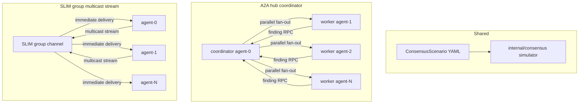

# SLIM vs A2A v2 — Consensus Streaming Benchmark

## Goals

- **Fair comparison:** identical consensus logic, agent count, think-time, and termination rules for both implementations
- **Highlight SLIM:** group multicast streaming delivers findings to all agents faster than A2A coordinator fan-out
- **Configurable scale:** sweep `agents` (e.g. 2, 5, 10, 17, 32) and coordination pressure (think time, finding rate)
- **Same reporting UX as v1:** Taskfile tasks → append TSV → HTML dashboard
- **Isolation:** new module at [`benchmarks/slim-vs-a2a-v2/`](benchmarks/slim-vs-a2a-v2/); v1 ([`benchmarks/slim-vs-a2a/`](benchmarks/slim-vs-a2a/)) unchanged

**Primary success metric:** `consensus_wall_ms` — time from run start until all agents report the same agreed value. SLIM should win increasingly as `agents` grows.

---

## Consensus Problem (shared by both implementations)

### Scenario: Distributed Hypothesis Convergence

N agents independently evaluate shards of evidence (simulated CPU work). Each agent maintains a local hypothesis `(value, confidence)`. Agents emit **findings** whenever local state changes. The run succeeds when **every agent holds the identical hypothesis**.

### Simulation rules (deterministic, no LLM)

- Each agent starts with `value = i % K`, `confidence = 0.1`
- Each think cycle (sleep `think_time_ms`): recompute locally using agent_id + round + received findings; emit if changed
- On receiving a peer finding: merge via deterministic merge function; may re-think and re-emit
- Consensus when all agents hold the same `value` (target derived deterministically from N via `targetMode: majority`)
- Terminate on consensus or `max_rounds` exceeded (failure)

**Why this fits transport benchmarking:** agents run in parallel and emit findings continuously while working. Transport latency directly affects convergence speed — unlike v1's DAG where context updates happen only at task boundaries.

### Scenario config (`ConsensusScenario` YAML)

```yaml
apiVersion: bench.agntcy.io/v2
kind: ConsensusScenario
metadata:
  name: hypothesis-convergence-10agents
spec:
  agents: 10
  thinkTimeMs: 50
  findingEmitDelayMs: 5
  maxRounds: 100
  targetMode: majority
  seed: 42
```

Generated sweep files: `plans/sweeps/hypothesis-{N}ag-{think}ms.yaml` via `tools/gen_scenario`.

---

## Transport Architecture



### A2A (`a2a-coordinator-stream`)

| Aspect | Design |
|--------|--------|
| Topology | Hub-and-spoke: `agent-0` is coordinator; workers `agent-1..N-1` |
| Coordinator | Receives findings, deduplicates, fans out to all other agents in parallel goroutines |
| Streaming | Enable A2A agent card `Streaming: true`; use a2a-go streaming/subscribe APIs (Phase 0 spike) |
| Fallback | Parallel unary `SendMessage` per target if streaming unavailable |
| Reference | Current sequential fan-out in [`a2a/internal/client/client.go`](benchmarks/slim-vs-a2a/a2a/internal/client/client.go) `PushContext` |

### SLIM (`slim-group-multicast-stream`)

| Aspect | Design |
|--------|--------|
| Topology | Single SLIM group — all N agents are peers (no coordinator) |
| Finding publish | `group.CallMulticastStream(...)` — one publish, all members receive on open stream |
| Setup | Reuse group pattern from [`slim/internal/client/client.go`](benchmarks/slim-vs-a2a/slim/internal/client/client.go) `subsetGroup` + `SetupGroup` |
| v2 upgrade over v1 | v1 uses `CallMulticastUnary`; v2 uses **multicast streaming** for continuous finding propagation |

---

## Package Layout

```
benchmarks/slim-vs-a2a-v2/
├── go.mod
├── Taskfile.yml
├── plans/
│   ├── README.md
│   └── sweeps/
├── internal/
│   ├── scenario/          # YAML load, validate, GenerateOptions
│   ├── consensus/         # shared simulator: merge, target, termination
│   ├── metrics/           # RunResult + consensus fields + TSV
│   └── benchlog/          # adapt from v1
├── a2a/
│   ├── cmd/agent/main.go
│   ├── cmd/runner/main.go
│   └── internal/
│       ├── client/client.go
│       ├── coordinator/coordinator.go
│       └── protocol/protocol.go
├── slim/
│   ├── cmd/agent/main.go
│   ├── cmd/runner/main.go
│   └── internal/
│       ├── client/client.go
│       └── protocol/protocol.go
├── tools/
│   ├── gen_scenario/main.go
│   └── report/main.go
├── reports/               # gitignored
└── tests/
    ├── suite_test.go
    └── consensus_test.go
```

Register in [`benchmarks/Taskfile.yml`](benchmarks/Taskfile.yml):

```yaml
  slim-vs-a2a-v2:
    taskfile: ./slim-vs-a2a-v2/Taskfile.yml
    dir: ./slim-vs-a2a-v2
    excludes: [default]
```

**Reuse from v1 (copy, not cross-module import):** `benchlog`, SLIM stack startup Taskfile patterns, `slimctl` download, agent spawning, TSV append pattern from [`internal/metrics/metrics.go`](benchmarks/slim-vs-a2a/internal/metrics/metrics.go).

### Pinned dependencies (same as v1)

| Dependency | Version | Notes |
|------------|---------|-------|
| `github.com/agntcy/slim-bindings-go` | **v1.4.0** | Multicast streaming API spike targets this release |
| `slimctl` | **slimctl-v1.4.0** | Local dataplane for SLIM runs |
| `github.com/a2aproject/a2a-go/v2` | **v2.3.0** | A2A coordinator streaming |

Taskfile vars (mirror [`benchmarks/slim-vs-a2a/Taskfile.yml`](benchmarks/slim-vs-a2a/Taskfile.yml)):

```yaml
COMPARE_SLIM_BINDINGS_VERSION: '{{ .COMPARE_SLIM_BINDINGS_VERSION | default "v1.4.0" }}'
COMPARE_SLIMCTL_TAG: '{{ .COMPARE_SLIMCTL_TAG | default "slimctl-v1.4.0" }}'
```

`go.mod` require line: `github.com/agntcy/slim-bindings-go v1.4.0`

---

## Metrics Schema

Extend v1 `RunResult` with consensus-specific fields:

| Field | Description |
|-------|-------------|
| `consensus_wall_ms` | **Primary:** start → all agents agree |
| `consensus_round` | Round number when consensus reached |
| `findings_emitted` | Total findings published |
| `findings_received_total` | Sum across agents |
| `avg_propagation_ms` | Mean time from emit → all others received |
| `p95_propagation_ms` | Tail latency of finding delivery |
| `last_agent_converge_ms` | Straggler: slowest agent to reach consensus |
| `coord_fanout_ms` | Time in coordination transport |
| `stream_rpc_count` | Streaming/multicast ops |
| `unicast_rpc_count` | Point-to-point ops |

TSV columns (tab-separated, append mode):

```
scenario_name  domain  implementation  agents  consensus_wall_ms  consensus_round
findings_emitted  avg_propagation_ms  p95_propagation_ms  last_agent_converge_ms
coord_fanout_ms  stream_rpc_count  unicast_rpc_count  success  error
```

---

## Taskfile Tasks

Mirror [`benchmarks/slim-vs-a2a/Taskfile.yml`](benchmarks/slim-vs-a2a/Taskfile.yml):

| Task | Purpose |
|------|---------|
| `build` | Build `a2a-agent`, `a2a-runner`, `slim-agent`, `slim-runner` |
| `deps:slim-bindings-setup` | CGO bindings |
| `deps:slimctl-download` | Local SLIM dataplane |
| `validate:scenarios` | Validate YAML scenarios |
| `compare:cleanup` | Kill stray agent processes |
| `compare:suite` | All default scenarios: A2A then SLIM → `reports/results.tsv` |
| `compare:plan` | Single scenario: `PLAN=hypothesis-convergence-10agents` |
| `compare:sweep` | Agent/think-time sweep → `reports/sweep.tsv` |
| `compare:report` | `go run ./tools/report --tsv reports/results.tsv --sweep-tsv reports/sweep.tsv -o reports/index.html` |
| `compare:ci:smoke` | Small sweep + report (~2 min) |
| `test` | Ginkgo suite with `RUN_SLIM_VS_A2A_V2=1` |

Example usage:

```bash
cd benchmarks/slim-vs-a2a-v2
task compare:plan PLAN=hypothesis-convergence-10agents
task compare:sweep SWEEP_AGENTS=2,5,10,17 SWEEP_THINK_MS=10,20,50
task compare:report
```

Sweep env vars: `SWEEP_AGENTS` (default `2,5,10,17`), `SWEEP_THINK_MS` (default `10,20,50`), `SWEEP_FAMILY` (default `hypothesis-convergence`).

---

## HTML Report

Adapt [`tools/report/main.go`](benchmarks/slim-vs-a2a/tools/report/main.go):

- Per-scenario comparison table: consensus wall ms, last agent converge, avg/p95 propagation, stream RPC count
- Delta columns: `(A2A − SLIM) / A2A` — positive = SLIM faster
- Sweep section: table with agents, think ms, implementation, consensus metrics

---

## Implementation Phases

### Phase 0 — API spike
- Confirm `slim-bindings-go` **v1.4.0** multicast streaming API (`CallMulticastStream` or equivalent)
- Confirm a2a-go **v2.3.0** streaming/subscribe for coordinator push
- Prototype finding propagation latency measurement

### Phase 1 — Shared core
- `internal/scenario` — YAML schema + validator
- `internal/consensus` — deterministic simulator
- `internal/metrics` — RunResult + TSV append
- `tools/gen_scenario` — sweep YAML generator

### Phase 2 — SLIM path
- `slim-agent` — group member, inbound stream handler, think loop
- `slim-runner` — start agents, create group, run until consensus
- `slim/internal/client` — `PublishFindingStream`, propagation timestamps

### Phase 3 — A2A path
- `a2a-agent` — coordinator/worker roles + streaming handler
- `a2a-runner` — spawn N agents, designate agent-0 as coordinator
- `a2a/internal/coordinator` — receive finding, parallel fan-out

### Phase 4 — Harness and CI
- Taskfile (all tasks above)
- `tools/report` HTML dashboard
- Optional `.github/workflows/test-slim-vs-a2a-v2.yaml`
- `plans/README.md`

### Phase 5 — Validation
- Verify SLIM `consensus_wall_ms` < A2A at N >= 10
- Confirm determinism with fixed `seed`

---

## Key Design Decisions

| Decision | Choice | Rationale |
|----------|--------|-----------|
| Separate folder | `slim-vs-a2a-v2` | Different workload (consensus vs DAG); v1 CI unchanged |
| A2A coordinator | `agent-0` is coordinator | Models realistic hub pattern; SLIM has no hub |
| Shared simulator | `internal/consensus` | Same merge/terminate logic; only I/O differs |
| SLIM transport | Multicast stream (not unary) | v2 differentiator vs v1 |
| SLIM bindings version | **slim-bindings-go v1.4.0** | Same pin as v1; multicast streaming API validated against this release |
| Agent count fairness | N total processes: A2A = 1 coord + N-1 workers; SLIM = N peers | Document in README |

---

## Relationship to v1

| | slim-vs-a2a (v1) | slim-vs-a2a-v2 |
|--|-----------------|----------------|
| Workload | YAML DAG task execution | Continuous consensus loop |
| Coordination trigger | Task completion / contextUpdates | Finding emission during parallel work |
| SLIM transport | Multicast unary | Multicast streaming |
| A2A transport | Sequential unicast fan-out | Coordinator parallel stream fan-out |
| Primary metric | `total_wall_clock_ms`, `context_push_ms` | `consensus_wall_ms`, `avg_propagation_ms` |
| Plan kind | `ExecutionPlan` | `ConsensusScenario` |

---

## Open Questions (Phase 0)

1. ~~SLIM bindings version~~ **Resolved:** use `slim-bindings-go v1.4.0` and `slimctl-v1.4.0` (same as v1). Phase 0 confirms the exact multicast streaming method name in this release.
2. A2A streaming — a2a-go v2.3.0 server-push suitability vs parallel unary fallback
3. Coordinator fairness — N-1 workers + 1 coordinator vs external runner-level coordinator
