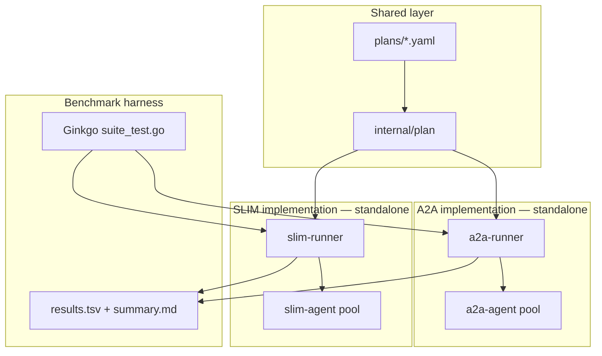

# SLIM vs A2A Multi-Agent DAG Benchmark

## Goal

Build a reproducible benchmark in CSIT that shows **when SLIM Multicast RPC is favorable over direct A2A gRPC** in a distributed multi-agent workload:

- **Phase 1 (plans):** Hand-author YAML execution plans with concrete agent/task names — no code generator
- **Phase 2 (implementation):** Separate A2A and SLIM runners/agents that execute those plans and emit metrics
- Tasks use **concrete domain-specific names** (network probe, pod log scrape, route recalc, etc.) but **simulate/mock** execution via timed sleeps and canned outputs
- Parallel branches become **obsolete** when an upstream dependency fails or times out
- **SLIM advantages under test** (three pillars):
  1. **Fast sync** — agents stay aligned on shared execution state with low coordination latency
  2. **Fast context change sharing** — when upstream results or priorities shift, all affected agents receive updated context in one fan-out (multicast) vs N point-to-point pushes
  3. **Fast failure propagation** — one multicast abort/notify vs K sequential A2A calls to cancel obsolete parallel work
- **A2A and SLIM are completely separate implementations** — separate binaries, packages, and RPC stacks; only YAML plan parsing/validation is shared (`internal/plan`)

## Recommended defaults (questions skipped)


| Decision      | Choice                                               | Rationale                                                                                                                                                                           |
| ------------- | ---------------------------------------------------- | ----------------------------------------------------------------------------------------------------------------------------------------------------------------------------------- |
| Runtime       | **Local processes + embedded SLIM dataplane**        | Matches `[benchmarks/agntcy-slim](benchmarks/agntcy-slim)`; fast iteration; K8s can be phase 2                                                                                      |
| Orchestration | **Separate runners per transport** (`a2a-runner`, `slim-runner`) | Each impl owns its own DAG driver; same plan YAML input, no shared scheduler interface                                                                                              |
| Language      | **Go-only**                                          | User asked for A2A Go SDK + SLIM Go bindings; existing Python `slima2a` is out of scope                                                                                             |
| SLIM API      | **Custom slimrpc protobuf + multicast group client** | Multicast for context push + cancel/notify; upstream pattern in `[client_group.go](/Users/smagyari/dev/slim/data-plane/bindings/go/examples/slimrpc/simple/cmd/client_group/client_group.go)` |
| Shared code   | **`internal/plan` only**                             | YAML load, validate, DAG helpers; no shared transport, agent, or orchestrator code                                                                                                 |


## Architecture



### Why this highlights SLIM

Both implementations execute the **same YAML plan** (same agents, tasks, timings, dependencies). Implementations are independent but must produce **comparable metrics**. SLIM's three advantages show up at coordination boundaries:

| Coordination event | A2A gRPC (sequential / point-to-point) | SLIM Multicast RPC |
| ------------------ | -------------------------------------- | ------------------ |
| Execute task on one agent | Unary gRPC `SendMessage` per task | Point-to-point slimrpc unary |
| **Share context update** to K agents (new priority, revised hypothesis, abort reason) | **K sequential** push RPCs | **1 multicast** `PushContext` fan-out |
| **Sync barrier** — all agents acknowledge phase transition | **K sequential** sync RPCs + client-side aggregation | **1 multicast** `SyncPhase` + aggregated stream responses |
| Cancel obsolete parallel tasks (K agents) | **K sequential** cancel RPCs | **1 multicast** `CancelTasks` |
| Notify dependents of failure | **M sequential** notify RPCs | **1 multicast** `NotifyFailure` |

Metrics like `context_push_ms`, `sync_barrier_ms`, `cancel_propagation_ms`, `obsolete_tasks_completed`, and `total_wall_clock_ms` should show SLIM advantage as agent count, parallel fan-out, and context-change frequency grow.

## New package layout

Create `[benchmarks/agntcy-multi-agent/](benchmarks/agntcy-multi-agent/)` and register it in `[benchmarks/Taskfile.yml](benchmarks/Taskfile.yml)`:

```
benchmarks/agntcy-multi-agent/
├── Taskfile.yml
├── internal/
│   └── plan/                             # ONLY shared code: YAML schema, validation, DAG helpers
├── a2a/                                  # completely separate A2A implementation
│   ├── proto/                            # optional A2A task payload JSON schema (not slim proto)
│   ├── cmd/
│   │   ├── agent/main.go                 # a2a-agent — generic worker, differs by name/port only
│   │   └── runner/main.go                # a2a-runner — loads plan, drives DAG via A2A gRPC
│   └── internal/
│       ├── executor/                     # task mock execution (sleep, timeout, cancel)
│       ├── scheduler/                    # DAG state machine for A2A path
│       └── client/                       # a2a-go card resolve, gRPC calls
├── slim/                                 # completely separate SLIM implementation
│   ├── proto/taskdag/v1/taskdag.proto    # slimrpc service (Execute, Cancel, PushContext, SyncPhase)
│   ├── cmd/
│   │   ├── agent/main.go                 # slim-agent — generic worker on dataplane
│   │   └── runner/main.go                # slim-runner — loads plan, drives DAG via slimrpc
│   └── internal/
│       ├── executor/                     # same mock semantics as a2a (duplicated, not imported)
│       ├── scheduler/                    # DAG state machine for SLIM path
│       └── client/                       # slim-bindings-go p2p + multicast group client
├── tools/
│   └── report_dashboard.go
├── plans/
│   └── domains/                          # hand-authored plans only (committed)
│       ├── k8s-incident-response.yaml
│       ├── urban-traffic-reroute.yaml
│       └── mobile-nav-assistant.yaml
├── tests/
│   ├── suite_test.go
│   ├── dag_benchmark_test.go
│   └── helpers_test.go
├── templates/
└── reports/
```

**Separation rule:** `a2a/` must not import `slim/` or `slim-bindings-go`. `slim/` must not import `a2a/` or `a2a-go`. Both import only `internal/plan`. Mock executor logic may be duplicated intentionally to keep stacks independent (or extracted later behind build tags — not in v1).

Reuse patterns from:

- Metrics/reporting: `[benchmarks/agntcy-slim/tests/benchmark_models_test.go](benchmarks/agntcy-slim/tests/benchmark_models_test.go)`, `[benchmark_suite_test.go](benchmarks/agntcy-slim/tests/benchmark_suite_test.go)`
- SLIM lifecycle: `[benchmarks/agntcy-slim/tests/config/local-slim.yaml](benchmarks/agntcy-slim/tests/config/local-slim.yaml)` + `startLocalSlimStack()` helpers
- A2A gRPC server/client: `[integrations/agntcy-a2a/fixtures/go-jsonrpc-server/main.go](integrations/agntcy-a2a/fixtures/go-jsonrpc-server/main.go)`

Dependencies (new `go.mod` under benchmark package):

- `github.com/a2aproject/a2a-go/v2` (already pinned in `[integrations/go.mod](integrations/go.mod)`)
- `github.com/agntcy/slim-bindings-go` (same version as `[benchmarks/agntcy-slim/tests/echo-client/go.mod](benchmarks/agntcy-slim/tests/echo-client/go.mod)`)
- `gopkg.in/yaml.v3`, Ginkgo/Gomega, Gonum (for CI stats, optional)

## YAML plan schema

Each plan file describes **named agents**, **named tasks** (domain-realistic labels), dependencies, and timing. Tasks mock real work via `completionTimeSec` / `maxCompletionTimeSec` / canned `output`.

### Schema (unchanged structure, concrete names)

```yaml
apiVersion: bench.agntcy.io/v1
kind: ExecutionPlan
metadata:
  name: k8s-incident-response
  domain: kubernetes-troubleshooting
  description: Parallel diagnosis of a failing deployment; branches abort if root cause found early
spec:
  defaults:
    completionTimeSec: 0.3
    maxCompletionTimeSec: 2.0
  maxRetries: 1
agents:
  - id: cluster-scout
    slimName: agntcy/bench/cluster-scout
    a2aPort: 9101
  - id: log-miner
    slimName: agntcy/bench/log-miner
    a2aPort: 9102
  - id: metrics-analyst
    slimName: agntcy/bench/metrics-analyst
    a2aPort: 9103
  # ...
tasks:
  - id: fetch-pod-status
    name: "Fetch pod status for checkout-api"
    agent: cluster-scout
    dependsOn: []
    completionTimeSec: 0.25
    maxCompletionTimeSec: 1.0
    output: "phase=CrashLoopBackOff replicas=3/5"
  - id: scrape-container-logs
    name: "Scrape last 500 lines from crashing pod"
    agent: log-miner
    dependsOn: [fetch-pod-status]
    completionTimeSec: 0.6
    maxCompletionTimeSec: 1.5
    injectFailure: false
    output: "OOMKilled exit=137"
  # ...
contextUpdates:                          # optional — triggers SLIM multicast vs A2A sequential push
  - afterTask: fetch-pod-status
    payload: "hypothesis=memory-pressure priority=high"
    targetAgents: [log-miner, metrics-analyst, event-correlator]
```

Fields:
- `agents[].id` — logical role name used in task assignments
- `agents[].slimName` — SLIM dataplane identity (`org/group/app`)
- `agents[].a2aPort` — gRPC port for A2A agent card (A2A impl only)
- `tasks[].name` — human-readable task label (reporting + realism)
- `contextUpdates[]` — models mid-plan context shifts (key SLIM sync/context benchmark axis)

### Three hand-authored domain plans (committed in `plans/domains/`)

#### 1. `k8s-incident-response.yaml` — K8s cluster troubleshooting

**Scenario:** `checkout-api` deployment degraded; agents diagnose in parallel; if OOM root cause confirmed early, cancel speculative branches (network partition check, node drain simulation).

| Agent | Role |
|-------|------|
| `cluster-scout` | Pod/status/endpoint discovery |
| `log-miner` | Container log extraction |
| `metrics-analyst` | Prometheus metric queries |
| `event-correlator` | K8s event timeline merge |
| `network-prober` | Service mesh / DNS checks |
| `runbook-executor` | Remediation steps (scale, rollback) |

Example tasks: `fetch-pod-status`, `scrape-container-logs`, `query-memory-metrics`, `correlate-oom-events`, `probe-service-mesh`, `simulate-rollback`, `apply-memory-limit-patch`. DAG depth ~4, fan-out up to 4 parallel probes; one injected failure path on `probe-service-mesh` to exercise cancel propagation.

#### 2. `urban-traffic-reroute.yaml` — Realtime traffic incident response

**Scenario:** Highway accident detected; traffic agents recompute routes, update signals, notify transit; if primary corridor reopening ETA drops, cancel stale detour plans.

| Agent | Role |
|-------|------|
| `incident-detector` | Ingest camera/sensor feed |
| `flow-modeler` | Traffic flow simulation |
| `route-planner` | Dynamic route recalculation |
| `signal-coordinator` | Intersection timing adjustments |
| `transit-dispatcher` | Bus/rail reroute |
| `alert-broadcaster` | Waze/511-style push |

Example tasks: `detect-lane-closure`, `estimate-queue-length`, `recalc-northbound-routes`, `recalc-southbound-routes`, `adjust-signal-phasing`, `reroute-bus-line-42`, `publish-driver-alerts`. High parallel fan-out (N/S/E/W route recalc); context update when `estimate-queue-length` revises ETA.

#### 3. `mobile-nav-assistant.yaml` — Android voice assistant (navigate + search)

**Scenario:** User on phone says *"Take me to the nearest open pharmacy that's on the way to the airport"*; agents parse intent, search POIs, plan route, refine as user moves; if user changes priority ("actually, coffee first"), obsolete search/nav branches cancel.

| Agent | Role |
|-------|------|
| `intent-parser` | NLU / slot extraction from Android input |
| `poi-searcher` | Places API search (pharmacy, coffee) |
| `route-engine` | Turn-by-turn path computation |
| `traffic-watcher` | Live ETA adjustments |
| `ui-composer` | Android notification / map tile updates |
| `session-tracker` | User location + command history sync |

Example tasks: `parse-voice-command`, `search-pharmacy-near-route`, `search-coffee-near-route`, `compute-route-to-airport-via-poi`, `refine-route-live-traffic`, `render-map-overlay`, `push-voice-prompt`. Context update when user amends command mid-flight (`priority=coffee-first`); multiple parallel POI searches become obsolete on context change.

Plan scale (agent count, task count, fan-out, failure injection) is defined **directly in each YAML file**. Add or edit plans by hand; no generator.

## Agent design (two separate binaries, identical mock semantics)

### `a2a/cmd/agent` — A2A-only generic worker

```
a2a-agent --agent-id=cluster-scout --grpc-port=9101 --card-port=8081
```

- Implements `a2asrv` executor: parse JSON task payload (`taskId`, `completionTimeSec`, `maxCompletionTimeSec`, `context`)
- Mock execution: sleep, enforce deadline, honour cancel messages, return canned `output`
- Exposes gRPC via `a2agrpc.NewHandler`; agent card at `/.well-known/agent-card.json`
- **No SLIM imports**

All agents share this one binary; they differ only by `--agent-id`, ports, and SLIM name mapping comes from plan YAML (SLIM agents use `slimName` field).

### `slim/cmd/agent` — SLIM-only generic worker

```
slim-agent --slim-name=agntcy/bench/cluster-scout --endpoint=127.0.0.1:46357
```

- Registers slimrpc `TaskDAG` service from `slim/proto/taskdag/v1/taskdag.proto`
- Same mock execution semantics as A2A agent (duplicated code in `slim/internal/executor`)
- Subscribes to `slimName` on dataplane
- **No A2A imports**

## Runners (two separate DAG drivers)

Each runner is a **standalone program** with its own scheduler — no shared `Transport` interface.

### `a2a/cmd/runner`

1. Load plan via `internal/plan`
2. Spawn `a2a-agent` processes for each agent in plan
3. Run DAG scheduler (`a2a/internal/scheduler`):
   - Execute ready tasks via sequential/per-task A2A gRPC `SendMessage`
   - On `contextUpdates`: **loop** `SendMessage` to each target agent with updated payload
   - On failure/timeout: **loop** cancel RPCs to each affected agent
   - Track sync barrier latency as time to complete all sequential round-trips
4. Write `RunMetrics` JSON to stdout / file

### `slim/cmd/runner`

1. Load same plan via `internal/plan`
2. Start local SLIM dataplane (or connect to existing)
3. Spawn `slim-agent` processes for each agent
4. Run DAG scheduler (`slim/internal/scheduler`):
   - Execute ready tasks via point-to-point slimrpc unary
   - On `contextUpdates`: **multicast** `PushContext` to group channel of target agents
   - On phase transitions requiring ack: **multicast** `SyncPhase`, aggregate stream responses
   - On failure/timeout: **multicast** `CancelTasks` + `NotifyFailure`
5. Write same-shape `RunMetrics` JSON

Proto (`slim/proto/taskdag/v1/taskdag.proto`):

```protobuf
service TaskDAG {
  rpc ExecuteTask(ExecuteTaskRequest) returns (ExecuteTaskResponse);
  rpc CancelTask(CancelTaskRequest) returns (CancelTaskResponse);
  rpc PushContext(ContextUpdate) returns (ContextAck);
}
service TaskDAGGroup {
  rpc PushContextMulticast(ContextUpdate) returns (stream MulticastContextAck);
  rpc SyncPhase(PhaseSyncRequest) returns (stream MulticastPhaseAck);
  rpc CancelTasks(CancelTasksRequest) returns (stream MulticastCancelResult);
  rpc NotifyFailure(NotifyFailureRequest) returns (stream MulticastNotifyResult);
}
```

## Metrics schema

Both runners emit the **same JSON/TSV shape** (defined in `tests/` or a tiny shared `internal/metrics` struct-only package with no runtime logic — acceptable if needed for report aggregation only). Fields:

| Field | Description |
| ----- | ----------- |
| `plan_name`, `domain` | Plan id and domain label |
| `implementation` | `a2a-grpc` or `slim-multicast` |
| `agents`, `tasks` | Plan scale |
| `total_wall_clock_ms` | End-to-end plan execution |
| `tasks_completed`, `tasks_failed`, `tasks_timed_out` | Outcome counts |
| `tasks_cancelled`, `obsolete_tasks_completed` | Wasted work after failure/context change |
| `retries_attempted`, `retries_succeeded` | Retry stats |
| `context_push_ms` | Time to deliver context update to all target agents |
| `sync_barrier_ms` | Time for all agents to ack phase sync |
| `cancel_propagation_ms` | Failure → all cancels acked |
| `execute_rpc_count`, `multicast_rpc_count`, `sequential_rpc_count` | RPC overhead breakdown |
| `makespan_ms` | Critical-path duration (successful runs) |

Comparison report auto-computes per-plan deltas: `(a2a - slim) / a2a` for wall clock, context push, sync barrier, cancel propagation, obsolete tasks.

## Taskfile and execution

`[benchmarks/agntcy-multi-agent/Taskfile.yml](benchmarks/agntcy-multi-agent/Taskfile.yml)`:


| Task                       | Purpose                                                   |
| -------------------------- | --------------------------------------------------------- |
| `deps:slim-bindings-setup` | Reuse slim benchmark setup                                |
| `benchmark:suite`          | All plans in `plans/domains/` × both implementations      |
| `benchmark:ci:smoke`       | 3 domain plans × both implementations (CI subset)         |
| `benchmark:report`         | Build HTML dashboard                                      |


Configurable env vars:

- `PLAN_DIR=plans/domains` (default; all hand-authored plans)
- `IMPLEMENTATIONS=a2a,slim`
- `RUN_BENCHMARK_DAG=1` (gate like `SLIM_RUN_BENCHMARK_SUITE`)

Example local run:

```bash
task benchmarks:multi-agent:benchmark:ci:smoke RUN_BENCHMARK_DAG=1
task benchmarks:multi-agent:benchmark:suite RUN_BENCHMARK_DAG=1
```

## Test suite (Ginkgo)

`[tests/dag_benchmark_test.go](benchmarks/agntcy-multi-agent/tests/dag_benchmark_test.go)`:

- Label: `benchmark-dag`
- Skip unless `RUN_BENCHMARK_DAG=1`
- For each plan in `PLAN_DIR`:
  1. Run `a2a-runner --plan=...` → collect metrics
  2. Run `slim-runner --plan=...` (start SLIM stack first) → collect metrics
- Assert all three domain plans complete on both implementations; report deltas (no hard latency assertions)

## CI integration (phase 2)

Add workflow modeled on `[.github/workflows/test-benchmarks-slim.yaml](.github/workflows/test-benchmarks-slim.yaml)`:

- Path filter: `benchmarks/agntcy-multi-agent/`**
- Job runs `benchmark:ci:smoke` only (small plan, ~2 min)
- Publish artifact to test reports site via `[.github/workflows/publish-test-reports-pages.yaml](.github/workflows/publish-test-reports-pages.yaml)`

## Expected outcome

Running the domain plans (especially `urban-traffic-reroute` and `mobile-nav-assistant` with frequent context updates) should show:

- Similar `makespan_ms` on **successful** runs with no context churn (happy path parity)
- Lower `context_push_ms` and `sync_barrier_ms` with **SLIM** when `contextUpdates` fan out to many agents
- Lower `cancel_propagation_ms` and `obsolete_tasks_completed` with **SLIM** when failures abort parallel branches (K8s incident plan)
- Lower `total_wall_clock_ms` for SLIM on context-heavy and failure-heavy plans

**Narrative:** SLIM Multicast RPC enables **fast sync**, **fast shared context propagation**, and **fast failure propagation** — all critical when many agents execute interdependent realtime tasks and obsolete work must be abandoned quickly.

## Implementation order

### Phase 1 — Plans (YAML only, no Go)

1. Finalize schema in plan doc / `internal/plan` types
2. Hand-author 3 domain plans in `plans/domains/` with full agent lists, task DAGs, timings, `contextUpdates`, and injected failure paths

### Phase 2 — Implementation

3. **`internal/plan`** — YAML load, validation, DAG helpers
4. **`a2a/` stack** — agent + runner + scheduler; end-to-end on domain plans
5. **`slim/` stack** — proto, agent + runner + scheduler with multicast; same plans end-to-end
6. **Context sync + failure propagation** — wire `contextUpdates`, cancel obsolete tasks, retries
7. **Metrics + TSV + templates + dashboard**
8. **Taskfile + Ginkgo suite + CI smoke**

## Out of scope (initial version)

- **`plangen` / automated plan scaling** — plans are hand-authored; add new YAML files manually
- K8s/Kind deployment (design allows later: same agent/runner binaries in Helm)
- Python `slima2a` agents
- A2A-over-SLIM third transport leg (could be added later as `slim-a2a`)
- Directory/registry integration (`agntcy-dir`) — unrelated to this comparison

