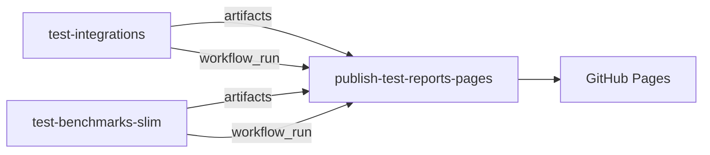

# Streamline GitHub Pages test-report publishing

**Suggested issue title:** Consolidate GitHub Pages publishing into a single workflow

**Scope:** Existing CSIT Pages pipeline — integrations + SLIM benchmark reports under `site/`.

---

## Summary

Today, test results are uploaded as Actions artifacts, but **site assembly and Pages deploy happen in two places**. This proposal makes **test workflows produce artifacts only** and **`publish-test-reports-pages` the sole deployer**, with shared shell scripts so the logic is not duplicated in YAML.

---

## Current flow (simplified)

- **`test-integrations`** → uploads A2A + directory conformance artifacts.
- **`test-benchmarks-slim`** → runs benchmarks, stages files, uploads `slim-benchmark-*-report` artifacts; on `main` push also runs **`publish-pages`** (full site build + deploy).
- **`publish-test-reports-pages`** → triggered after **`test-integrations`** on default branch; downloads artifacts, rebuilds dashboards, deploys Pages.

Both publish paths use the same steps: download → `report_dashboard.go` → `build-site-landing-page.sh` → `deploy-pages`. They share concurrency group `test-report-pages`.

Key files: [`.github/workflows/publish-test-reports-pages.yaml`](.github/workflows/publish-test-reports-pages.yaml), [`.github/workflows/test-benchmarks-slim.yaml`](.github/workflows/test-benchmarks-slim.yaml) (`publish-pages` job), [`.github/scripts/build-site-landing-page.sh`](.github/scripts/build-site-landing-page.sh).

---

## Problems

1. **Two deployers for one site** — `publish-test-reports-pages` and `test-benchmarks-slim` → `publish-pages` both call `deploy-pages`. Same concurrency group serializes them, but ownership and “what triggered the live site?” are unclear.

2. **Publish logic duplicated** — ~140 lines in `publish-pages` largely repeat `publish-test-reports-pages` (A2A run lookup, artifact download, Go dashboards, landing page).

3. **HTML built twice for benchmarks** — Smoke/capacity jobs run `task benchmarks:slim:reports:dashboard` when staging artifacts; the publish job runs `report_dashboard.go` again for the merged `site/benchmarks/slim/index.html`.

4. **Asymmetric triggers** — Publish workflow listens only to `test-integrations`. Benchmark-only updates on `main` depend on the inline `publish-pages` job, not the dedicated publish workflow.

5. **Hard to maintain** — Large inline bash in workflow YAML (API resolution, conditional downloads) is difficult to review, reuse, or dry-run locally.

---

## Proposed changes

### Responsibility split

| Layer | Does | Does not |
|-------|------|----------|
| **Test workflows** | Run tests, stage **raw** report files, `upload-artifact` | Deploy Pages, build merged site HTML |
| **`publish-test-reports-pages`** | Resolve source runs, assemble `site/`, deploy Pages | Run benchmarks or integration tests |

### Single publisher

- **Remove** `publish-pages` from [`test-benchmarks-slim.yaml`](.github/workflows/test-benchmarks-slim.yaml).
- **Trigger** `publish-test-reports-pages` on `workflow_run` when **`test-integrations`** or **`test-benchmarks-slim`** completes on the default branch (keep today’s guards: not cancelled, default branch only).
- **Keep** `workflow_dispatch` and manual run-ID overrides (including optional external slim CSV import).

### Centralize assembly

- **New** [`.github/scripts/resolve-pages-source-runs.sh`](.github/scripts/resolve-pages-source-runs.sh) — find latest completed runs with expected artifact names.
- **New** [`.github/scripts/build-pages-site.sh`](.github/scripts/build-pages-site.sh) — download artifacts, run A2A + SLIM `report_dashboard.go`, call `build-site-landing-page.sh`.
- **New** [`.github/actions/deploy-github-pages`](.github/actions/deploy-github-pages) — `configure-pages` → `upload-pages-artifact` → `deploy-pages` only.

Publish workflow becomes: checkout → setup Go → resolve → build → deploy.

### Leaner benchmark artifacts

- Smoke/capacity staging: copy raw files from `reports/` to `published/{smoke,capacity}/` only; **drop** per-job `reports:dashboard` in CI.
- Merged `site/benchmarks/slim/index.html` is produced **only** in `build-pages-site.sh`.

---

## Benefits

- **One place to change publishing** — deploy, permissions, and site layout live in one workflow + scripts.
- **Faster, simpler CI jobs** — benchmark jobs stop doing HTML work that publish repeats anyway.
- **Predictable updates** — any completing producer on `main` triggers the same publish path; no benchmark-only deploy fork.
- **Easier review and debugging** — shell scripts can be run locally with explicit run IDs; YAML stays thin.
- **Clear separation** — CI artifacts are inputs; the published `site/` tree is built only at deploy time.

---

## Work items

1. Add `resolve-pages-source-runs.sh` and `build-pages-site.sh`; refactor [`publish-test-reports-pages.yaml`](.github/workflows/publish-test-reports-pages.yaml) to use them.
2. Add `deploy-github-pages` composite action.
3. Add `test-benchmarks-slim` to `workflow_run` triggers; delete `publish-pages` job.
4. Remove `reports:dashboard` from smoke/capacity staging in [`test-benchmarks-slim.yaml`](.github/workflows/test-benchmarks-slim.yaml).

---

## Acceptance criteria

- [ ] A `main` push that only runs `test-benchmarks-slim` triggers **one** Pages deploy via `publish-test-reports-pages` (not `publish-pages`).
- [ ] `test-integrations` completion on `main` still deploys; site picks up latest benchmark artifacts via resolve when present.
- [ ] PR workflow runs upload artifacts but **do not** deploy Pages.
- [ ] `workflow_dispatch` with optional run IDs still builds and deploys a full `site/`.
- [ ] Published URLs and paths unchanged (`site/a2a/`, `site/benchmarks/slim/`, `site/directory/`, root landing page).

---

## Files touched

| File | Change |
|------|--------|
| `.github/scripts/resolve-pages-source-runs.sh` | New |
| `.github/scripts/build-pages-site.sh` | New |
| `.github/actions/deploy-github-pages/action.yaml` | New |
| `.github/workflows/publish-test-reports-pages.yaml` | Refactor; add benchmark `workflow_run` |
| `.github/workflows/test-benchmarks-slim.yaml` | Remove `publish-pages`; lean staging |
