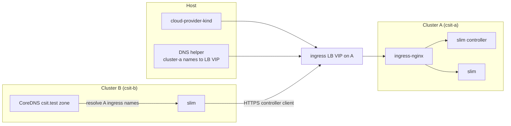

# KinD multicluster + slim (ingress on A)

KinD clusters **csit-a** / **csit-b**; **ingress-nginx** runs on **A** only. **[cloud-provider-kind](https://github.com/kubernetes-sigs/cloud-provider-kind)** assigns a **LoadBalancer VIP** on **A**. Cluster **B** pods resolve **`control.cluster-a.csit.test`** / **`slim.cluster-a.csit.test`** to that IP via patched CoreDNS ([`coredns/README.md`](coredns/README.md)). On the **host**, the **local DNS helper** ([`compose/dns/`](compose/dns/)) resolves cluster **A** ingress names to the **same VIP**, so browsers and **`slimctl`** hit **ingress-nginx on :80/:443** directly (no host edge proxy).

**Optional KinD loopback maps:** [`kind/cluster-a.yaml`](kind/cluster-a.yaml) still exposes **127.0.0.1:10080** / **10443** for debugging; normal stack use is **DNS → LB IP**. Cluster **B** has **9080** / **9443** maps for host access without in-cluster ingress.

**One command (from this directory):** `task stack:up`.

## Layout

| Path | Purpose |
|------|---------|
| [`kind/`](kind/) | KinD cluster configs |
| [`helm/values/`](helm/values/) | ingress-nginx, slim, slim-control-plane values |
| [`compose/dns/`](compose/dns/) | Local `*.csit.test` DNS helper (generated `Corefile` + `csittest.zone` → LB IP for cluster A) |
| [`scripts/`](scripts/) | cpkind, LB wait, CoreDNS merge, DNS verify, macOS resolver install, headless Service, slimctl port-forward helper |
| **`.gen/`** | Generated: `ingress-a.env`, `cloud-provider-kind.stderr` (gitignored) |

## Tasks (canonical)

| Task | Purpose |
|------|---------|
| **`task stack:up`** | **`cluster:up`** + **`stack:install`** — full environment |
| **`task stack:down`** | Uninstall Helm releases, `compose` down, delete clusters |
| **`task stack:install`** | On existing clusters: cpkind → ingress **A** → apps **A** → LB wait → CoreDNS **B** → apps **B** → DNS compose → **`compose:dns:verify`** |
| **`task prereq:stack`** | `prereq` plus Helm + Go (implicit start of **`stack:install`**) |
| **`task cluster:up`** | `prereq` + both KinD clusters |
| **`task cluster:teardown`** | Delete both clusters (no Helm) |
| **`task compose:dns:up`** / **`compose:dns:down`** | Render Corefile + Compose for [`compose/dns`](compose/dns) |
| **`task compose:dns:verify`** | **`dig`** cluster-A ingress names @ **`127.0.0.1:${CSIT_LOCAL_DNS_HOST_PORT:-8053}`** vs **`.gen/ingress-a.env`** (also runs at end of **`stack:install`**) |
| **`task compose:dns:resolver:install`** | **macOS:** write **`/etc/resolver/csit.test`** → **`127.0.0.1:${CSIT_LOCAL_DNS_HOST_PORT:-8053}`** (requires **`sudo`**) |
| **`task ingress:install:a`** | Helm **ingress-nginx** on cluster **A** |
| **`task ingress:a:wait-lb-ip`** | Wait for LB IP → **`.gen/ingress-a.env`** |
| **`task apps:install:cluster-a`** / **`apps:install:cluster-b`** | Slim / controller Helm (order matters; use **`stack:install`** for the full sequence) |

**Typical sequence inside `stack:install`:** `prereq:stack` → `kind:cloud-provider-kind:up` → `ingress:install:a` → `apps:install:cluster-a` → `ingress:a:wait-lb-ip` → `coredns:apply:cluster-b:ingress-alias` → `apps:install:cluster-b` → `compose:dns:up` → **`compose:dns:verify`**.

## Prerequisites

- Docker, [kind](https://kind.sigs.k8s.io/), kubectl, jq, [Task](https://taskfile.dev/)
- **`dig`** (bind / dnsutils) — required for **`task compose:dns:verify`** and recommended when debugging host DNS
- **Helm** + **Go** for **`stack:up`** / **`stack:install`** (cloud-provider-kind uses `go run`)
- **GHCR access** for OCI Helm charts (`oci://ghcr.io/agntcy/slim/helm/*`) and container images (defaults **1.4.0** / **v1.4.0**). Override with **`SLIM_*_VERSION`**, **`CTRL_*_VERSION`**, **`SLIM_IMAGE_TAG`**, **`CTRL_IMAGE_TAG`**.
- **`slimctl`** — set **`SLIMCTL_PATH`** or let **`task slimctl:ensure`** download a release (**`SLIMCTL_VERSION`**, default **1.4.0**).

### macOS host DNS for `*.csit.test`

After **`task compose:dns:up`**, install split DNS once (writes **`/etc/resolver/csit.test`**; matches **`CSIT_LOCAL_DNS_HOST_PORT`**, default **8053**):

```bash
task compose:dns:resolver:install
```

Then flush the DNS cache: **`sudo dscacheutil -flushcache`** and **`sudo killall -HUP mDNSResponder`**.

Verify the helper (always use **`@127.0.0.1 -p …`** — macOS **`dig`** without **`@`** often ignores **`/etc/resolver/`**):

```bash
dig @127.0.0.1 -p "${CSIT_LOCAL_DNS_HOST_PORT:-8053}" +short control.nb.cluster-a.csit.test A
```

### Host `slimctl` via DNS → ingress (northbound)

Use when **`control.nb.cluster-a.csit.test`** resolves to the cluster **A** ingress target (LB VIP by default, or **`127.0.0.1`** when using the loopback DNS override — see **Limitations**). **`task stack:install`** ends with **`compose:dns:verify`**.

1. **DNS helper:** **`dig @127.0.0.1 -p "${CSIT_LOCAL_DNS_HOST_PORT:-8053}" +short control.nb.cluster-a.csit.test A`** should match **`source .gen/ingress-a.env && echo "$INGRESS_A_LB_IP"`** unless you set **`CSIT_INGRESS_IP_A=127.0.0.1`** for Docker Desktop (then expect **`127.0.0.1`** and use **`:10080`** in step 3).

2. **Controller Helm / Ingress:** **`task helm:install:controller`** (or your **`helm upgrade`** for **`slim-control`** on **`kind-csit-a`**).

3. **Run `slimctl`** (plaintext gRPC to ingress **:80**, or **:10080** when DNS points at loopback — KinD maps **`127.0.0.1:10080` → node :80**):

   ```bash
   unset SLIMCTL_COMMON_OPTS_TLS_INSECURE SLIMCTL_COMMON_OPTS_TLS_INSECURE_SKIP_VERIFY
   SLIMCTL_CONFIG=/dev/null ./slimctl -s 'http://control.nb.cluster-a.csit.test:80' controller node list
   ```

   Use **`…:10080`** instead of **`:80`** only with **`CSIT_INGRESS_IP_A=127.0.0.1`** and **`task compose:dns:up`** after re-rendering the zone.

4. **Timeouts to the VIP:** if **`nc -vz "$INGRESS_A_LB_IP" 80`** from the host fails (common on Docker Desktop), use the loopback DNS path above; do not mix LB IP with port **10080**.

5. **Still failing:** **`kubectl -n ingress-nginx logs deploy/ingress-nginx-controller`** while reproducing. North ingress enables **`http2 on`** for cleartext gRPC (**[`helm/values/controller.yaml`](helm/values/controller.yaml)**).

### Optional demos (not part of `stack:install`)

- **`task echo-agent:server:deploy`** / **`task echo-agent:client:deploy`** — sample A2A workloads on the slim dataplane.
- **`task slimctl:controller:link:outline`** / **`task slimctl:controller:route:outline`** — **`slimctl`** via port-forward (**`SLIMCTL_PATH`** or **`task slimctl:download`**).

## Quick start

```bash
cd kind-slim-multi-host
task prereq
task stack:up
```

Tear down:

```bash
task stack:down
```

Clusters only (no ingress / slim):

```bash
task cluster:up
task cluster:teardown
```

## Architecture (simplified)



- **Host → controller (northbound):** `http://control.nb.cluster-a.csit.test:80` (plaintext gRPC via ingress; see [`helm/values/controller.yaml`](helm/values/controller.yaml)).
- **Host → slim on A:** `https://slim.cluster-a.csit.test:443` (TLS termination at ingress).
- **Host → slim on B:** resolve **`slim.cluster-b.csit.test`** → **127.0.0.1**, connect with explicit port **`9080`** / **`9443`** ([`kind/cluster-b.yaml`](kind/cluster-b.yaml)).
- **slim B → controller:** unchanged — **`https://control.cluster-a.csit.test:443`** from pods; CoreDNS on **B** points **`*.cluster-a.csit.test`** at the **A** LB IP. Docker Desktop edge cases: [`helm/values/slim-cluster-b.docker-desktop.yaml`](helm/values/slim-cluster-b.docker-desktop.yaml).

## Helm values

| File | Role |
|------|------|
| [`helm/values/ingress-nginx-kind.yaml`](helm/values/ingress-nginx-kind.yaml) | **ingress-nginx** (KinD; NodePort then Helm promotes **A** to LoadBalancer) |
| [`helm/values/controller.yaml`](helm/values/controller.yaml) | slim-control-plane on **A** |
| [`helm/values/slim-cluster-a.yaml`](helm/values/slim-cluster-a.yaml) | Slim on **A** |
| [`helm/values/slim-cluster-b.yaml`](helm/values/slim-cluster-b.yaml) | Slim on **B**; **`ingresses: []`** |
| [`helm/values/slim-cluster-b.docker-desktop.yaml`](helm/values/slim-cluster-b.docker-desktop.yaml) | Optional overlay when LB VIP is unreachable from **B** pods |

**`apps:install:cluster-a`** runs after **`ingress:install:a`** (ingress chart pull may hit **`INGRESS_NGINX_HELM_REPO`** on first run unless cached).

Environment overrides: `CLUSTER_*`, `CTX_*`, **`CSIT_DNS_ZONE`**, **`CSIT_INGRESS_IP_A`** / **`CSIT_INGRESS_IP_B`**, **`CSIT_DNS_CATCHALL_IP`** (wildcard `*.csit.test` in zone file), **`INGRESS_SVC`**, **`INGRESS_NGINX_*`**, **`SLIM_CHART_VERSION`** / **`CTRL_CHART_VERSION`** / **`SLIM_SPIRE_CHART_VERSION`**, **`SLIM_IMAGE_TAG`** / **`CTRL_IMAGE_TAG`**, **`SLIMCTL_PATH`** / **`SLIMCTL_VERSION`**, **`CSIT_LOCAL_DNS_HOST_PORT`**.

## GitHub Actions

Workflow: [`../.github/workflows/test-slim-multicluster-private.yaml`](../.github/workflows/test-slim-multicluster-private.yaml) — pull images/charts from GHCR, install **slimctl** from GitHub releases → `task cluster:up` → load images → **`task stack:install`** → checks → **`task stack:down`**.

## Limitations

- **Dataplane `external_endpoint` (cluster A):** values use the in-cluster Service (**`agntcy-cluster-a-slim.cluster-a.svc.cluster.local:46357`**) so controllers and other pods reach the dataplane over the cluster network. **Pods** must not rely on host-only DNS names if those resolve to addresses unreachable from the pod network.
- **Snippet annotations:** [`helm/values/controller.yaml`](helm/values/controller.yaml) uses **`server-snippet`**; [`helm/values/ingress-nginx-kind.yaml`](helm/values/ingress-nginx-kind.yaml) sets **`allowSnippetAnnotations`** and **`enableAnnotationValidations: false`**.
- **Hostname:** only **`control.cluster-a.csit.test`** (and related ingress names) are wired from **B**; remote **`*.svc.cluster.local`** is not mirrored.
- **macOS cpkind:** **`kind:cloud-provider-kind:up`** may prompt for **sudo**; logs **`.gen/cloud-provider-kind.stderr`**.
- **CoreDNS merge scripts** expect `deployment/coredns` in `kube-system` on both clusters.
- **Host cannot reach LB VIP (Docker Desktop / environment):** optional fallback — set **`CSIT_INGRESS_IP_A=127.0.0.1`** when rendering DNS and call ingress on KinD maps **10080** / **10443** with explicit ports instead of **:80**/**:443** on the LB IP (see Architecture above).
